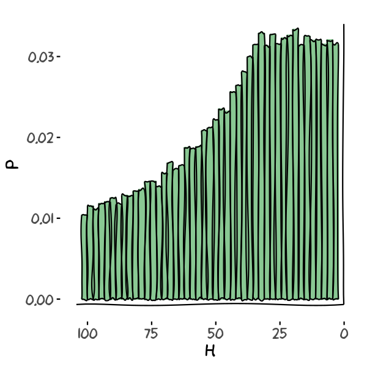

# Rejection Sampling: Gen I Capture Mechanics

This algorithm proposes a simplification of the Gen I Capture Dynamics of Pokémon games to practice the rejection sampling algorithm. 

# Capture Mechanics

Assume that trainers can find Pokémons with random health between 1 and their base maximum health, and that they cannot fight the Pokémon, nor they have any status modifier. In such case, the probability of catching a Pokémon can be approximated by[^1] :

$$p \approx \frac{\text{catchRate} + 1}{\text{ballMod} + 1} \times \frac{f + 1}{256}$$

where 

$$f = \frac{HP_{max} \times 255 \times 4}{HP_\text{current} \times \text{ballMod}}$$

[^1]: https://bulbapedia.bulbagarden.net/wiki/Catch_rate#Capture_method_.28Generation_I.29

# Problem proposed

Assume that you own a Pokémon Center and you want to estimate the number of potions you will need to heal all the captures of the day. Further, assume that trainers will only capture one type of Pokémon each day. To do so, you will need an array of *n_captured* Pokémons containing the health of each capture.

You should use the rejection sampling method to fill the array *captured_pokemon_health*. You can use the function *captureProbability* to estimate the probability.

You will also need to fill the histogram function for the code to work properly:
```C
void Histogram(int *data, double *Hist, int N_data, int N_intervalos,
                double *delta, double *minimo, double *maximo)
```

Plot the resulting histogram. Do you see any patterns? What do they mean?


